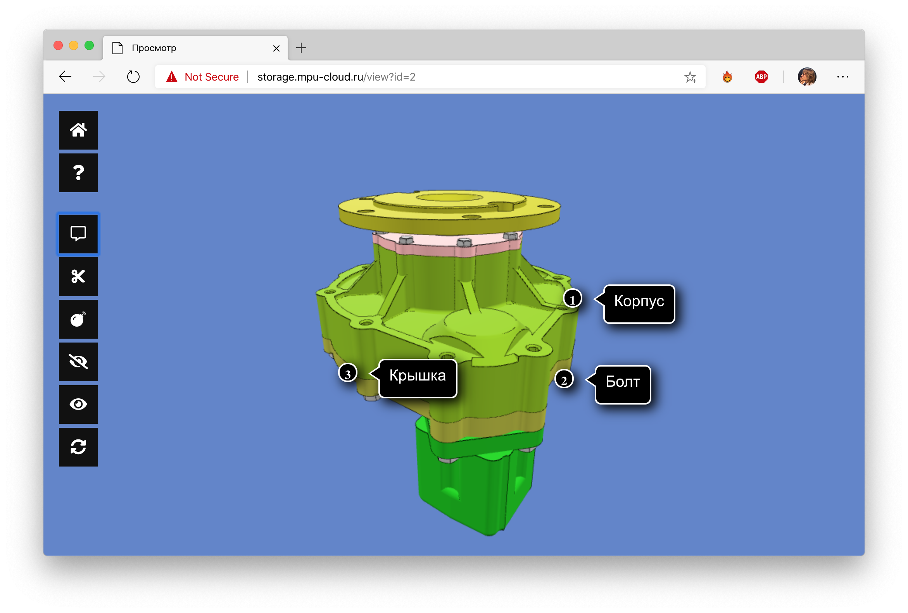
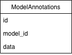
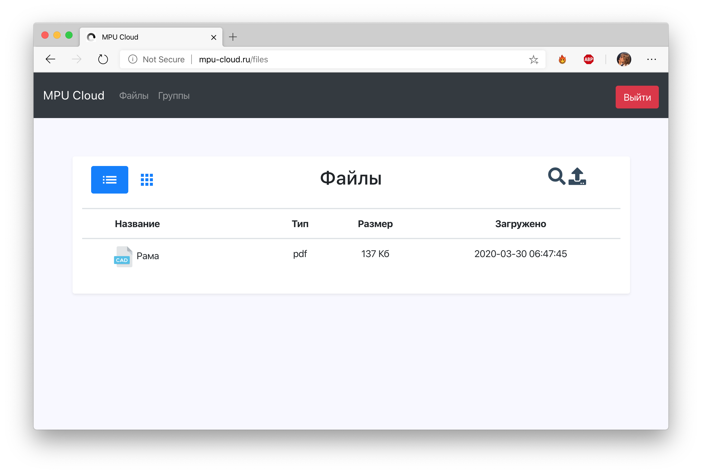
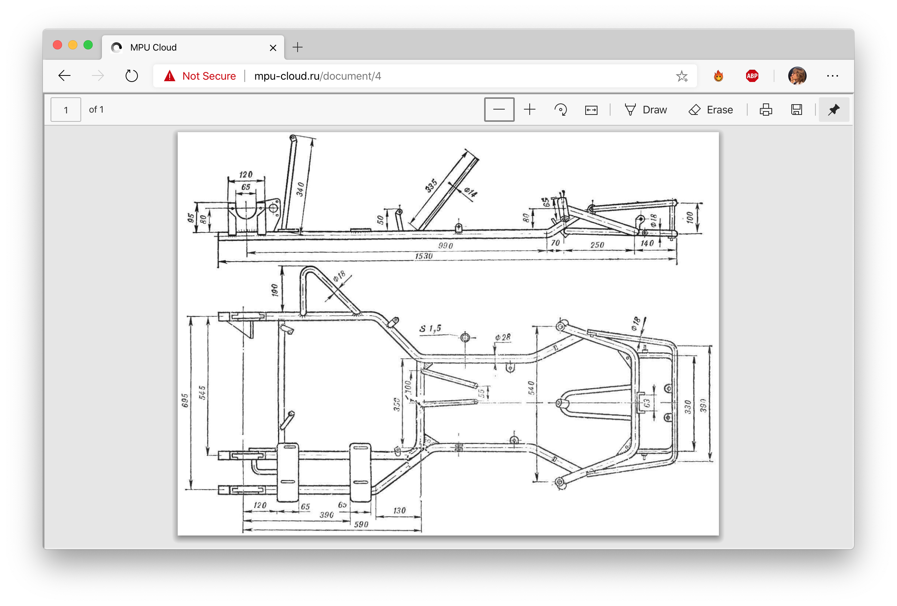

# Краткий отчет о проделанной работе Беседина А. В.

## Аннотации

Аннотации, создаваемые в 3D-viewer теперь сохраняются на сервере и после перезагрузки страницы подгружаются обратно в сцену.



Для сохранения аннотаций была создана новая таблица в базе данных, хранящая преобразованный JSON, на основе которого 3D-viewer воспроизводит аннотации.



``` sql
CREATE TABLE "ModelAnnotations" (
	"id"	INTEGER NOT NULL PRIMARY KEY AUTOINCREMENT UNIQUE,
	"model_id"	INTEGER NOT NULL,
	"data"	TEXT NOT NULL,
	FOREIGN KEY("model_id") REFERENCES "Files"("file_id")
);
```

---

## PDF-файлы

Для хранения чертежей и прочей необходимой документации добавлена поддержка файлов формата PDF, которые, как и 3D-модели, можно загружать на сервер и просматривать прямо на сайте.



