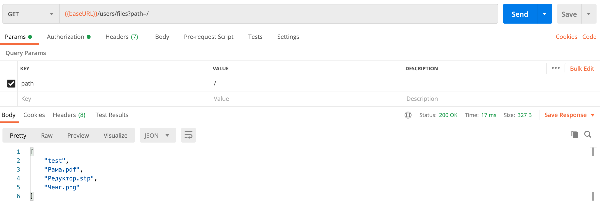
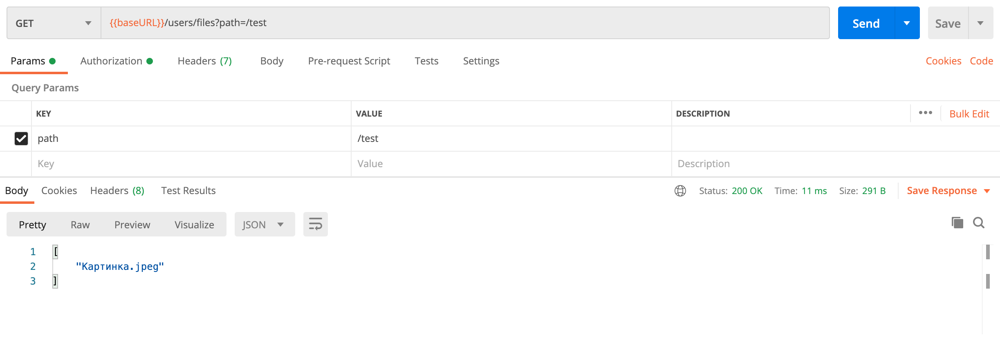
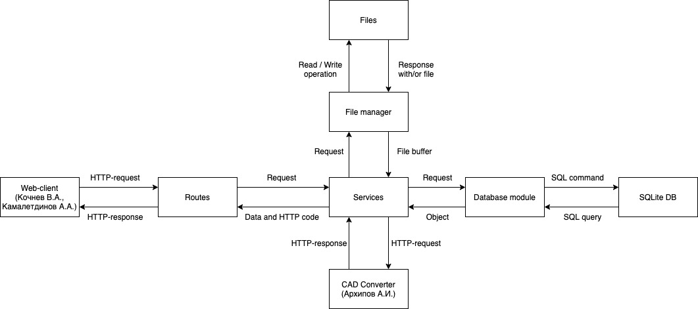
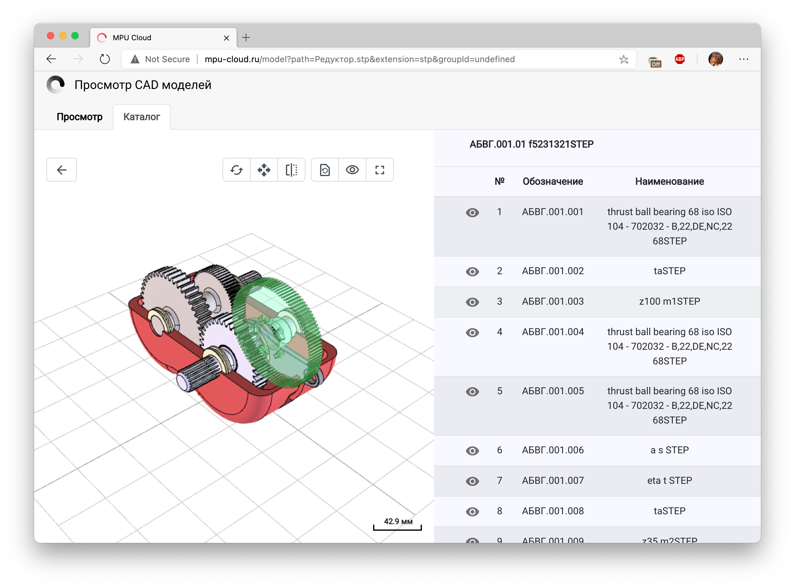
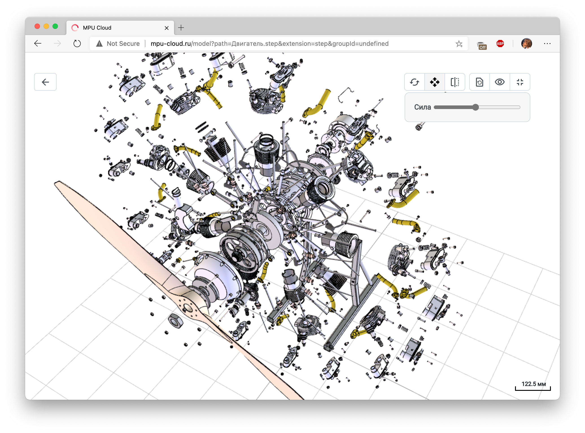

# Краткий отчет о разработке облачного хранилища

Разработчики:
- Сервер. Беседин А.В.
- Клиент. Кочнев В.А., Камалетдинов А.А.
- Конвертер. Архипов А.А. 

## Папки

Поддержка функционала папок со стороны сервера. В будущем планируется внедрить этот функционал на стороне клиента.

**Пример**

Корневая папка пользователя:

Папка test в корневой папке пользователя:

## Обновленная структура сервера

Для поддержки функционала папок, а также в качестве залога на будущее была переработана структура сервера и весь код был переписан с JavaScript на TypeScript.

Алгоритм работы:

- Веб-клиент делает запрос на сервер.

- Модуль Routes считывает header, body и query запроса и отправляет в нужный сервис.

- Сервис обрабатывает запрос. В процессе работы он может взаимодействовать с файловым менеджером, модулем базы данных или конвертером.

	- Файловый менеджер, считывает или записывает файлы/папки в папке, используемой сервером для хранения файлов (путь этой папки настраивается системным администратором). Возвращает определенный ответ и/или файл.

	- Модуль базы данных хранит заготовленные SQL-команды, на основе которых он осуществляет взаимодействие с базой данных. Возвращает определенный объект данных.

	- Конвертер конвертирует полученную 3D-модель из одного формата (например STEP) в другой (например GLTF). Возвращает определенный объект данных.

- В результате выполнения выполнения запроса, сервис формирует определенный объект данных с http-кодом и отправляет его в модуль Routes.

- Модуль Routes отправляет ответ клиенту с соответствующим http-кодом.

## Клиент

Клиент был частично переписан с JavaScript на TypeScript. Также были исправлены множественные баги, обнаруженные в результате полного тестирования сайта.

Разработан и внедрен новый 3D-вьювер, который теперь предоставляет следующий функционал:
- Каталог деталей.
- Скрытие деталей.
- Разнос модели.
- Добавление аннотаций.
- И др.

Пример каталога:

Пример разноса модели:

## Конвертер

Конвертер теперь создан в качестве отдельного приложения, написанного на чистом C++ (ранее он являлся JavaScript библиотекой, доступ к которой осуществлялся через Node.js сервер), что повысило его производительность и понизило требования к системным ресурсам.